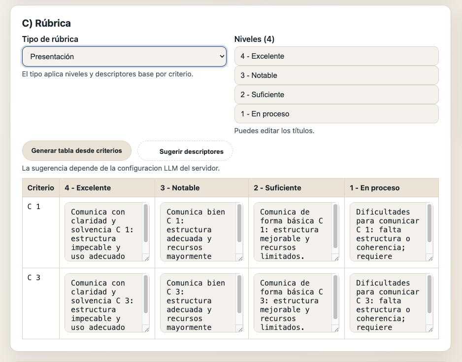

# LOMLOE SA + Rubric Generator (FastAPI) — Templates-first + IA opcional

[](https://github.com/manueljgranados/lomloe-sa-rubric-generator/actions)
[](#)
[](#)
[](#)
[](LICENSE)


Generador de **Situaciones de Aprendizaje (LOMLOE)** y **rúbricas** con un enfoque “templates-first” y reproducible:
- Núcleo determinista: **plantillas + validación** + exportación.
- Salida: **ZIP** con `SA.md`, `rubrica.md`, `SA.docx` (plantilla Word) y `metadata.json`.
- Rúbrica editable desde la UI: niveles y descriptores por criterio.
- “IA opcional” para sugerir descriptores sin afectar al núcleo (proveedor configurable / modo offline).

> Enfocado a docentes de **Tecnología e Ingeniería / FP** y como proyecto de portfolio (producto + ingeniería + utilidad real).

---

## Demo




---

## Funcionalidades

- Formulario web (mini web) para capturar:
  - nivel, materia, título
  - competencias y criterios (listas por líneas)
  - producto final, metodología, atención a la diversidad
  - instrumentos de evaluación
  - resumen (portada del Docx)
  - sesiones dinámicas (JSON)
- Rúbrica:
  - tipos de rúbrica (p. ej. proyecto / presentación / memoria técnica)
  - niveles editables (4)
  - tabla editable de descriptores por criterio (4 niveles)
  - sugerencias opcionales (endpoint dedicado)
- Exportación:
  - Markdown de SA (`.md`)
  - Markdown de rúbrica (`__rubrica.md`)
  - Docx desde plantilla Word (`.docx`)
  - `metadata.json` (input + derivados)
  - Empaquetado en ZIP con nombre normalizado (nivel + título)

---

## Tecnologías

- FastAPI + Jinja (UI server-side)
- Pydantic (validación)
- Jinja2 (plantillas Markdown)
- docxtpl (plantilla Word `.docx` + rellenado)
- Ruff + Pytest
- uv (gestión de dependencias/entorno)

---

## Requisitos

- Python **3.12+**
- uv instalado

---

## Puesta en marcha (local)

```bash
# 1) Instalar deps
uv sync --dev

# 2) Ejecutar
uv run uvicorn lomloe_sa_gen.main:app --reload

# 3) Abrir
# http://127.0.0.1:8000/
```
---

## Checks

```bash
uv run ruff format .
uv run ruff check .
uv run pytest -q
```

---

## Configuración

Crear el fichero `.env` en raiz y añadir este contenido:
- `LLM_ENABLED=true|false`
- `LLM_PROVIDER=disabled|rules`(modo offline predeterminado)

---

## Estructura del proyecto

- `src/lomloe_sa_gen/`
  - `main.py` (FastAPI)
  - `core/models.py` (SASpec, SessionSpec, RubricSpec…)
  - `services/`
    - `markdown.py` (render SA)
    - `rubric.py` (render rúbrica)
    - `packaging.py` (ZIP)
    - `naming.py` (nombres normalizados)
    - `metadata.py` (metadata.json)
    - `docx_template_export.py` (docxtpl)
    - `rubric_templates.py` (tipos de rúbrica)
  - `templates/` (Jinja2 para Markdown)
  - `assets/templates/` (plantilla Word .docx)
  - `assets/rubric_templates/` (tipos de rúbrica .json)
- `tests/` (pytest)

---

## Licencia
Apache-2.0
